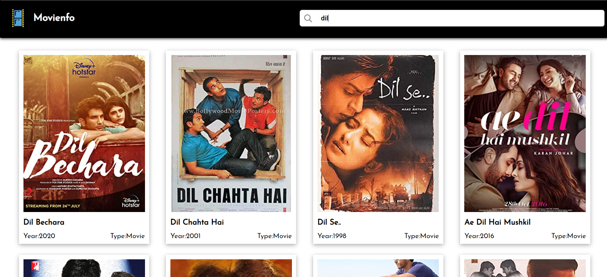
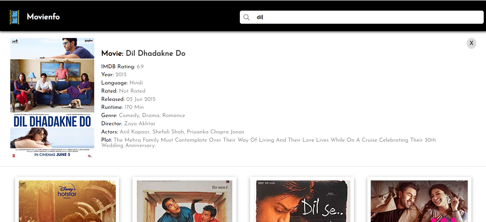

# Movienfo - React Based Application   

### About the Project
A single page web application that allows users to search about any movie, read about the cast and view its IMDb rating.

### Technologies

- React
  - Hooks
  - Components
- CSS
  - CSS Flex
- Javascript
  - Fetch API
  - ES6
- API
  - OMDB API

s

### API Used
Open Movie Database (OMDB) API

Generate API key from : http://www.omdbapi.com/apikey.aspx

### API Info

* Method: `GET`
* Search URL: `https://www.omdbapi.com/?s={MOVIE_NAME}&apikey={API_KEY}`
* Movie Details URL: `https://www.omdbapi.com/?i={MOVIE_ID}&apikey={API_KEY}`

### How It Works

- Search a movie in the search input
- Grabs the movie information from OMDB API.
- Information is returned has a JSON object
- Using React components to structure data into presentational format
- Using CSS to create visually appealing and user friendly application

### Screenshots

Movie Search Result:

Movie Detail:

